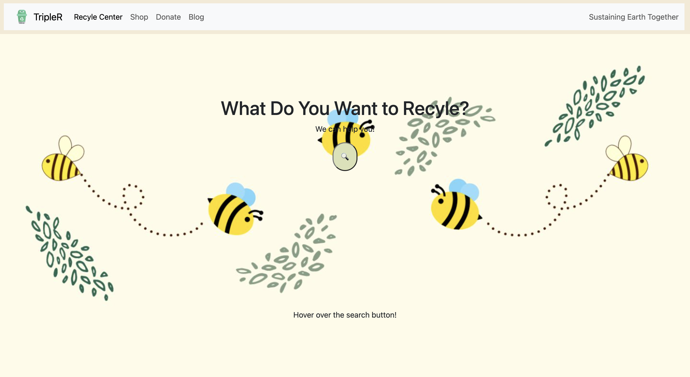
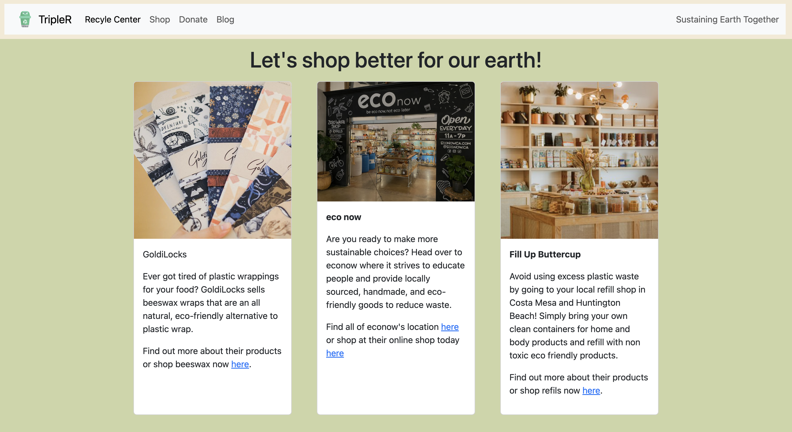
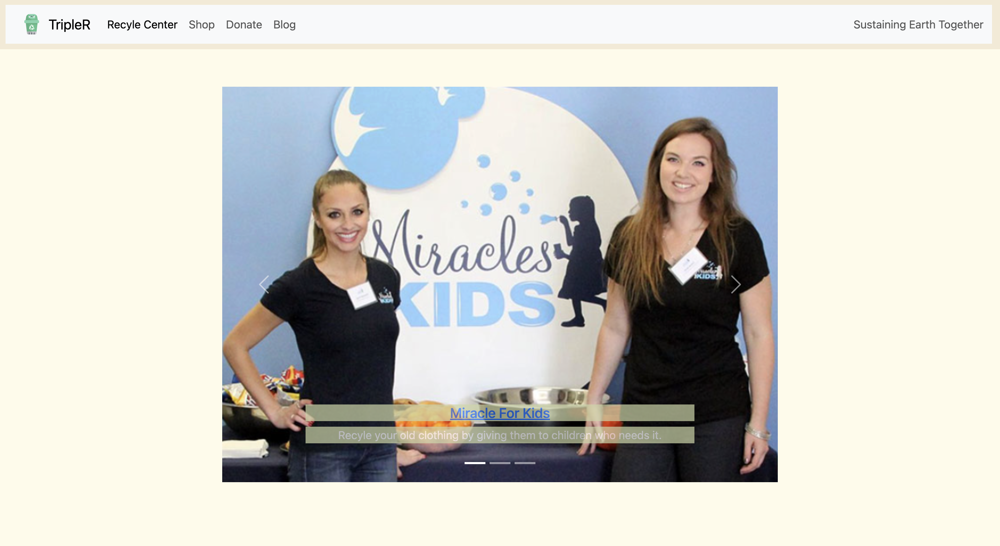
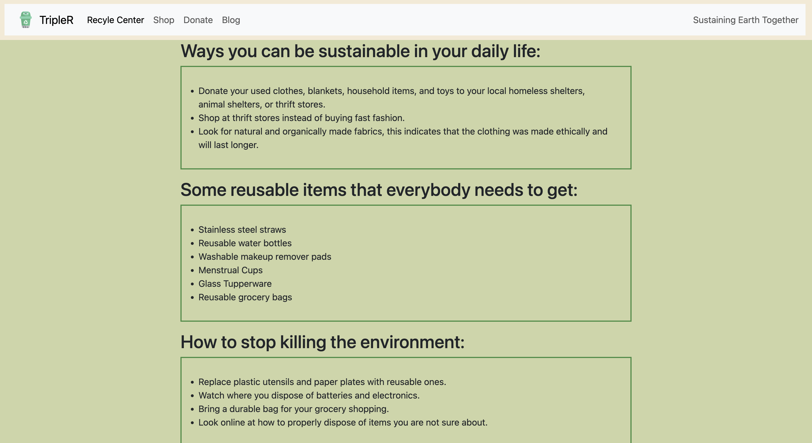

# 🌎AthenaHacks - Sustainability Website🍃
## Your go-to stop to sustaining our earth TOGETHER!

In this project, we made a website that promotes sustainability. You will find:

> Recyle Center♻️
:A feature of the website that educate you how to recyle different recylable materials, such as:
- Glass
- Compost 
- Plastic
- Aluminum
- Batteries

> Shop
:A feature that promotes eco-friendly business👩🏻‍💼.

> Donate
:A series of donation opportunities to get rid of old blankets, clothing, or other household items to people in need🙌🏻.

> Blog
:An educational information posts that tells you how to be a better friend for our earth🌱!

